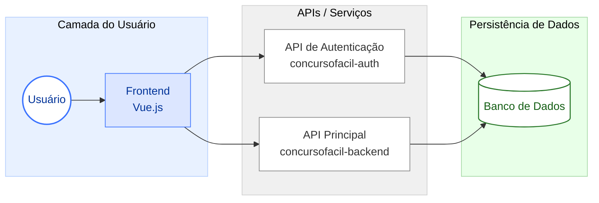

# Arquitetura do Sistema ConcursoFácil

Este documento apresenta a visão arquitetural planejada do sistema **ConcursoFácil**, descrevendo seus principais módulos, responsabilidades, tecnologias envolvidas e formas de comunicação entre serviços. O objetivo é fornecer um panorama claro, de alto nível, que oriente a evolução do produto e facilite sua manutenção ao longo do tempo.

---

## 1. Diagrama Geral da Arquitetura

---

## 2. Visão Geral da Arquitetura

O ConcursoFácil foi concebido como uma plataforma modular composta por três camadas principais:

1. **Frontend Web (SPA – Single Page Application)**
2. **Backend de Negócio (API principal)**
3. **Serviço de Autenticação (Microserviço independente)**

Cada módulo é responsável por uma parte específica da solução, permitindo escalabilidade e independência de deploys.

---

## 3. Componentes do Sistema

### 3.1. Frontend (concursofacil-frontend)
Aplicação web construída em **Vue.js**, responsável por:

- Interação com o usuário.
- Consumo das APIs do backend e do serviço de autenticação.
- Renderização dinâmica das páginas do dashboard, questões, simulado, desempenho etc.
- Controle de navegação e estado global do usuário.

### 3.2. Serviço de Autenticação (concursofacil-auth)
Microserviço independente baseado em **Laravel**, responsável por:

- Cadastro de usuários
- Login e emissão de tokens (JWT/Sanctum)
- Renovação e invalidação de tokens
- Gerenciamento simples de perfis

Este serviço mantém o fluxo de autenticação desacoplado da lógica do sistema.

### 3.3. Backend de Negócio (concursofacil-backend)
API principal escrita em **Laravel**, responsável por toda a lógica da plataforma:

- Banco de questões
- Tentativas, respostas e correções
- Estatísticas de desempenho
- Lógica de simulados
- Regras específicas da plataforma
- Integração com banco de dados central

Ele só responde a requisições autenticadas vindas do serviço de Auth.

---

## 4. Comunicação entre os Serviços

A comunicação segue o padrão:

- **Frontend → Auth:** autenticação, cadastro, login.
- **Frontend → Backend:** todas as funcionalidades internas após login.
- **Auth → Backend:** validação dos tokens quando necessário.
- **Backend → DB:** acesso às entidades reais da aplicação.

A autenticação é baseada em token e o Frontend armazena as credenciais temporariamente para realizar requisições subsequentes.

---

## 5. Persistência e Banco de Dados

A arquitetura prevê um banco de dados relacional único, organizado em tabelas como:

- usuários  
- questões  
- respostas  
- tentativas  
- categorias  
- disciplinas  

O serviço de Auth pode utilizar sua própria base ou compartilhar parcialmente, dependendo da estratégia de deploy.

---

## 6. Infraestrutura e Execução

A arquitetura foi pensada para ser executada em ambientes conteinerizados com **Docker**, permitindo:

- Separação clara entre serviços
- Ambientes reproduzíveis
- Deploy simplificado

Cada módulo possui seu próprio Dockerfile e pode ser escalado de forma independente.

---

## 7. Segurança

- Uso de tokens de autenticação
- CORS configurado entre serviços
- Camada dedicada de Auth isolando credenciais sensíveis
- Comunicação usando HTTPS em produção

---

## 8. Escalabilidade e Evolução

A arquitetura foi desenhada para permitir crescimento natural:

- Frontend substituível (qualquer SPA)
- Backend modular e com serviços adicionais futuros
- Microserviços independentes para autenticação e outros módulos
- Possibilidade de integrar relatórios, módulos premium, ranking, marketplace etc.

---

## 9. Conclusão

A arquitetura do ConcursoFácil foi planejada com foco em modularização, clareza de responsabilidades e expansão futura. Os serviços conversam de forma padronizada e cada parte pode evoluir sem impactar as demais, garantindo flexibilidade e longevidade ao projeto.

---

## Histórico de Versão

| **Data** | **Versão** | **Descrição** | **Autor** |
| :--------: | :--------: | :--------:  | :--------: |
| 10/09/2025 | 1.0 | Criação do Documento | Breno Fernandes |