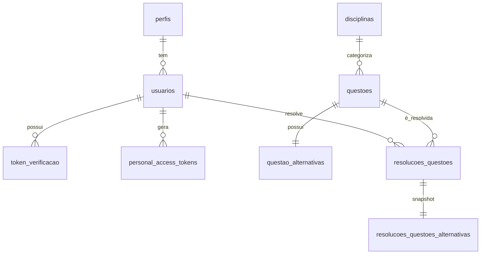

# 🗄️ Estrutura do Banco de Dados - ConcursoFácil

[](https://mysql.com/)
[](https://laravel.com/)

> ** Descrição:** Documentação completa da estrutura do banco de dados do sistema ConcursoFácil, incluindo DDL (Data Definition Language) e relacionamentos entre tabelas.

---

##  Índice

- [ Visão Geral](#-visão-geral)
- [ Autenticação e Autorização](#-autenticação-e-autorização)
- [ Gestão de Usuários](#-gestão-de-usuários)
- [ Sistema de Questões](#-sistema-de-questões)
- [ Resolução e Performance](#-resolução-e-performance)
- [ Relacionamentos](#-relacionamentos)

---

##  Visão Geral

O banco de dados `concursofacil` foi projetado para suportar um sistema completo de questões para concursos públicos, incluindo:

- ✅ **Autenticação** via tokens pessoais
- ✅ **Gestão de usuários** com perfis e permissões
- ✅ **Catalogação** de questões por disciplina
- ✅ **Resolução** e análise de performance
- ✅ **Auditoria** completa com timestamps

---

##  Autenticação e Autorização

###  **Tabela: `personal_access_tokens`**

> **Função:** Gerenciamento de tokens de acesso pessoal para autenticação API

```sql
CREATE TABLE personal_access_tokens (
  id BIGINT UNSIGNED AUTO_INCREMENT PRIMARY KEY,
  tokenable_type VARCHAR(255) NOT NULL,
  tokenable_id BIGINT UNSIGNED NOT NULL,
  name TEXT NOT NULL,
  token VARCHAR(64) UNIQUE NOT NULL,
  abilities TEXT NULL,
  last_used_at TIMESTAMP NULL,
  expires_at TIMESTAMP NULL,
  created_at TIMESTAMP NULL,
  updated_at TIMESTAMP NULL,
  INDEX (expires_at)
);
```

| Campo            | Tipo            | Descrição                     |
| ---------------- | --------------- | ----------------------------- |
| `id`             | BIGINT UNSIGNED | Chave primária                |
| `tokenable_type` | VARCHAR(255)    | Tipo de entidade (User, etc.) |
| `tokenable_id`   | BIGINT UNSIGNED | ID da entidade                |
| `token`          | VARCHAR(64)     | Hash único do token           |
| `abilities`      | TEXT            | Permissões do token (JSON)    |
| `expires_at`     | TIMESTAMP       | Data de expiração             |

---

##  Gestão de Usuários

###  **Tabela: `perfis`**

> **Função:** Definição de tipos de usuário e permissões no sistema

```sql
CREATE TABLE perfis (
  id_perfil BIGINT UNSIGNED AUTO_INCREMENT PRIMARY KEY,
  nome_perfil VARCHAR(30) NOT NULL,
  created_at TIMESTAMP NULL,
  updated_at TIMESTAMP NULL
);
```

| Campo         | Tipo            | Descrição                             |
| ------------- | --------------- | ------------------------------------- |
| `id_perfil`   | BIGINT UNSIGNED | Chave primária                        |
| `nome_perfil` | VARCHAR(30)     | Nome do perfil (Admin, Student, etc.) |

---

###  **Tabela: `usuarios`**

> **Função:** Informações completas dos usuários do sistema

```sql
CREATE TABLE usuarios (
  id_usuario BIGINT UNSIGNED AUTO_INCREMENT PRIMARY KEY,
  id_perfil BIGINT UNSIGNED NULL,
  primeiro_nome VARCHAR(50) NOT NULL,
  ultimo_nome VARCHAR(50) NOT NULL,
  username VARCHAR(50) UNIQUE NOT NULL,
  email VARCHAR(120) UNIQUE NOT NULL,
  senha_hash VARCHAR(255) NOT NULL,
  foto_url VARCHAR(255) NULL,
  cargo VARCHAR(80) NULL,
  educacao VARCHAR(150) NULL,
  habilidades VARCHAR(200) NULL,
  notas TEXT NULL,
  ativo BOOLEAN DEFAULT TRUE,
  ultimo_login DATETIME NULL,
  created_at TIMESTAMP NULL,
  updated_at TIMESTAMP NULL,
  FOREIGN KEY (id_perfil) REFERENCES perfis(id_perfil) ON DELETE SET NULL
);
```

<details>
<summary><strong>📊 Campos da Tabela Usuarios</strong></summary>

| Campo           | Tipo            | Restrições       | Descrição             |
| --------------- | --------------- | ---------------- | --------------------- |
| `id_usuario`    | BIGINT UNSIGNED | PRIMARY KEY      | Identificador único   |
| `id_perfil`     | BIGINT UNSIGNED | FK, NULL         | Referência ao perfil  |
| `primeiro_nome` | VARCHAR(50)     | NOT NULL         | Nome do usuário       |
| `ultimo_nome`   | VARCHAR(50)     | NOT NULL         | Sobrenome do usuário  |
| `username`      | VARCHAR(50)     | UNIQUE, NOT NULL | Nome de usuário       |
| `email`         | VARCHAR(120)    | UNIQUE, NOT NULL | Email único           |
| `senha_hash`    | VARCHAR(255)    | NOT NULL         | Senha criptografada   |
| `foto_url`      | VARCHAR(255)    | NULL             | URL da foto de perfil |
| `cargo`         | VARCHAR(80)     | NULL             | Cargo profissional    |
| `educacao`      | VARCHAR(150)    | NULL             | Formação acadêmica    |
| `habilidades`   | VARCHAR(200)    | NULL             | Skills do usuário     |
| `notas`         | TEXT            | NULL             | Anotações pessoais    |
| `ativo`         | BOOLEAN         | DEFAULT TRUE     | Status da conta       |
| `ultimo_login`  | DATETIME        | NULL             | Último acesso         |

</details>

---

###  **Tabela: `token_verificacao`**

> **Função:** Tokens para verificação de conta e recuperação de senha

```sql
CREATE TABLE token_verificacao (
  id_token BIGINT UNSIGNED AUTO_INCREMENT PRIMARY KEY,
  id_usuario BIGINT UNSIGNED NOT NULL,
  tipo ENUM('verificacao_conta','recuperacao_senha') NOT NULL,
  codigo CHAR(6) NOT NULL,
  expira_em DATETIME NOT NULL,
  usado BOOLEAN DEFAULT FALSE,
  created_at TIMESTAMP NULL,
  updated_at TIMESTAMP NULL,
  FOREIGN KEY (id_usuario) REFERENCES usuarios(id_usuario) ON DELETE CASCADE
);
```

| Campo       | Tipo     | Descrição                                  |
| ----------- | -------- | ------------------------------------------ |
| `tipo`      | ENUM     | `verificacao_conta` ou `recuperacao_senha` |
| `codigo`    | CHAR(6)  | Código de 6 dígitos                        |
| `expira_em` | DATETIME | Data/hora de expiração                     |
| `usado`     | BOOLEAN  | Status de utilização                       |

---

##  Sistema de Questões

###  **Tabela: `disciplinas`**

> **Função:** Categorização das questões por área de conhecimento

```sql
CREATE TABLE disciplinas (
  id_disciplina BIGINT UNSIGNED AUTO_INCREMENT PRIMARY KEY,
  nome VARCHAR(100) UNIQUE NOT NULL
);
```

| Campo           | Tipo            | Descrição                  |
| --------------- | --------------- | -------------------------- |
| `id_disciplina` | BIGINT UNSIGNED | Chave primária             |
| `nome`          | VARCHAR(100)    | Nome da disciplina (único) |

**Exemplos:** _Português, Matemática, Direito Constitucional, Informática_

---

###  **Tabela: `questoes`**

> **Função:** Armazenamento completo das questões de concursos

```sql
CREATE TABLE questoes (
  id_questao BIGINT UNSIGNED AUTO_INCREMENT PRIMARY KEY,
  codigo_questao VARCHAR(255) NULL,
  enunciado TEXT NOT NULL,
  tipo_questao ENUM('multipla_escolha','certo_errado') NOT NULL,
  resposta_correta CHAR(1) NOT NULL,
  gabarito_comentado TEXT NULL,
  id_disciplina BIGINT UNSIGNED NOT NULL,
  assunto VARCHAR(120) NULL,
  banca VARCHAR(100) NULL,
  instituicao VARCHAR(100) NULL,
  ano YEAR NULL,
  prova VARCHAR(100) NULL,
  dificuldade ENUM('muito_facil','facil','medio','dificil','muito_dificil') NOT NULL,
  nivel ENUM('fundamental','medio','superior') NULL,
  cargo VARCHAR(100) NULL,
  area_formacao VARCHAR(100) NULL,
  area_atuacao VARCHAR(100) NULL,
  criado_por INT NULL,
  atualizado_por INT NULL,
  created_at TIMESTAMP NULL,
  updated_at TIMESTAMP NULL,
  FOREIGN KEY (id_disciplina) REFERENCES disciplinas(id_disciplina)
);
```

<details>
<summary><strong>🏷️ Categorização e Metadados</strong></summary>

| Campo          | Tipo         | Valores                                                     | Descrição                |
| -------------- | ------------ | ----------------------------------------------------------- | ------------------------ |
| `tipo_questao` | ENUM         | `multipla_escolha`, `certo_errado`                          | Formato da questão       |
| `dificuldade`  | ENUM         | `muito_facil`, `facil`, `medio`, `dificil`, `muito_dificil` | Nível de dificuldade     |
| `nivel`        | ENUM         | `fundamental`, `medio`, `superior`                          | Nível de escolaridade    |
| `banca`        | VARCHAR(100) | -                                                           | Organizadora do concurso |
| `instituicao`  | VARCHAR(100) | -                                                           | Órgão público            |
| `ano`          | YEAR         | -                                                           | Ano da prova             |
| `cargo`        | VARCHAR(100) | -                                                           | Cargo do concurso        |

</details>

---

###  **Tabela: `questao_alternativas`**

> **Função:** Alternativas para questões de múltipla escolha

```sql
CREATE TABLE questao_alternativas (
  id_alternativa BIGINT UNSIGNED AUTO_INCREMENT PRIMARY KEY,
  id_questao BIGINT UNSIGNED NOT NULL,
  alternativa_a VARCHAR(255) NULL,
  alternativa_b VARCHAR(255) NULL,
  alternativa_c VARCHAR(255) NULL,
  alternativa_d VARCHAR(255) NULL,
  alternativa_e VARCHAR(255) NULL,
  created_at TIMESTAMP NULL,
  updated_at TIMESTAMP NULL,
  FOREIGN KEY (id_questao) REFERENCES questoes(id_questao) ON DELETE CASCADE
);
```

> ** Nota:** As alternativas são armazenadas em colunas separadas (A, B, C, D, E) para facilitar consultas e ordenação.

---

##  Resolução e Performance

###  **Tabela: `resolucoes_questoes`**

> **Função:** Histórico completo das resoluções dos usuários com snapshot dos dados da questão

```sql
CREATE TABLE resolucoes_questoes (
  id_resolucao BIGINT UNSIGNED AUTO_INCREMENT PRIMARY KEY,
  id_usuario BIGINT UNSIGNED NOT NULL,
  id_questao_original BIGINT UNSIGNED NOT NULL,
  codigo_questao VARCHAR(255) NULL,
  enunciado TEXT NOT NULL,
  tipo_questao ENUM('multipla_escolha','certo_errado') NOT NULL,
  resposta_correta CHAR(1) NOT NULL,
  gabarito_comentado TEXT NULL,
  disciplina VARCHAR(100) NULL,
  assunto VARCHAR(120) NULL,
  banca VARCHAR(100) NULL,
  instituicao VARCHAR(100) NULL,
  ano YEAR NULL,
  prova VARCHAR(100) NULL,
  dificuldade ENUM('muito_facil','facil','medio','dificil','muito_dificil') NOT NULL,
  nivel ENUM('fundamental','medio','superior') NULL,
  cargo VARCHAR(100) NULL,
  area_formacao VARCHAR(100) NULL,
  area_atuacao VARCHAR(100) NULL,
  criado_por INT NULL,
  atualizado_por INT NULL,
  alternativa_marcada CHAR(1) NOT NULL,
  acertou BOOLEAN NOT NULL,
  created_at TIMESTAMP NULL,
  updated_at TIMESTAMP NULL,
  FOREIGN KEY (id_usuario) REFERENCES usuarios(id_usuario) ON DELETE CASCADE,
  FOREIGN KEY (id_questao_original) REFERENCES questoes(id_questao) ON DELETE CASCADE
);
```

<details>
<summary><strong>📈 Campos de Performance</strong></summary>

| Campo                 | Tipo            | Descrição                       |
| --------------------- | --------------- | ------------------------------- |
| `id_questao_original` | BIGINT UNSIGNED | Referência à questão original   |
| `alternativa_marcada` | CHAR(1)         | Resposta escolhida pelo usuário |
| `acertou`             | BOOLEAN         | Se a resposta estava correta    |
| `created_at`          | TIMESTAMP       | Data/hora da resolução          |

> ** Design Pattern:** Esta tabela mantém um **snapshot** completo dos dados da questão no momento da resolução, garantindo integridade histórica mesmo se a questão original for modificada.

</details>

---

###  **Tabela: `resolucoes_questoes_alternativas`**

> **Função:** Snapshot das alternativas no momento da resolução

```sql
CREATE TABLE resolucoes_questoes_alternativas (
  id_alternativa BIGINT UNSIGNED AUTO_INCREMENT PRIMARY KEY,
  id_resolucao BIGINT UNSIGNED NOT NULL,
  alternativa_a VARCHAR(255) NULL,
  alternativa_b VARCHAR(255) NULL,
  alternativa_c VARCHAR(255) NULL,
  alternativa_d VARCHAR(255) NULL,
  alternativa_e VARCHAR(255) NULL,
  created_at TIMESTAMP NULL,
  updated_at TIMESTAMP NULL,
  FOREIGN KEY (id_resolucao) REFERENCES resolucoes_questoes(id_resolucao) ON DELETE CASCADE
);
```

---

##  Relacionamentos



###  **Resumo dos Relacionamentos**

| Tabela Pai              | Tabela Filha           | Tipo | Descrição                                |
| ----------------------- | ---------------------- | ---- | ---------------------------------------- |
| `perfis`                | `usuarios`             | 1:N  | Um perfil pode ter muitos usuários       |
| `usuarios`              | `token_verificacao`    | 1:N  | Um usuário pode ter múltiplos tokens     |
| `disciplinas`           | `questoes`             | 1:N  | Uma disciplina contém muitas questões    |
| `questoes`              | `questao_alternativas` | 1:1  | Cada questão tem suas alternativas       |
| `usuarios` × `questoes` | `resolucoes_questoes`  | N:M  | Muitos usuários resolvem muitas questões |

---

##  **Estatísticas e Métricas**

###  Consultas Úteis para Relatórios

```sql
-- Performance por usuário
SELECT
    u.primeiro_nome,
    u.ultimo_nome,
    COUNT(r.id_resolucao) as total_questoes,
    SUM(CASE WHEN r.acertou = 1 THEN 1 ELSE 0 END) as acertos,
    ROUND(AVG(CASE WHEN r.acertou = 1 THEN 1.0 ELSE 0.0 END) * 100, 2) as percentual_acerto
FROM usuarios u
LEFT JOIN resolucoes_questoes r ON u.id_usuario = r.id_usuario
GROUP BY u.id_usuario;

-- Questões mais difíceis
SELECT
    q.codigo_questao,
    q.enunciado,
    COUNT(r.id_resolucao) as total_tentativas,
    SUM(CASE WHEN r.acertou = 1 THEN 1 ELSE 0 END) as acertos,
    ROUND(AVG(CASE WHEN r.acertou = 1 THEN 1.0 ELSE 0.0 END) * 100, 2) as taxa_acerto
FROM questoes q
LEFT JOIN resolucoes_questoes r ON q.id_questao = r.id_questao_original
GROUP BY q.id_questao
HAVING total_tentativas > 10
ORDER BY taxa_acerto ASC;
```

---

##  **Manutenção e Otimização**

### Índices Recomendados

```sql
-- Índices para performance de consultas
CREATE INDEX idx_usuarios_email ON usuarios(email);
CREATE INDEX idx_usuarios_username ON usuarios(username);
CREATE INDEX idx_questoes_disciplina ON questoes(id_disciplina);
CREATE INDEX idx_questoes_dificuldade ON questoes(dificuldade);
CREATE INDEX idx_resolucoes_usuario ON resolucoes_questoes(id_usuario);
CREATE INDEX idx_resolucoes_data ON resolucoes_questoes(created_at);
CREATE INDEX idx_tokens_expiracao ON personal_access_tokens(expires_at);
```

###  **Backup e Restore**

```sql
-- Backup completo
mysqldump -u usuario -p concursofacil > backup_concursofacil.sql

-- Restaurar backup
mysql -u usuario -p concursofacil < backup_concursofacil.sql
```

---

##  **Notas Técnicas**

- **Charset:** UTF8MB4 (suporte a emojis e caracteres especiais)
- **Engine:** InnoDB (suporte a transações e foreign keys)
- **Versionamento:** Migrations do Laravel para controle de versão
- **Auditoria:** Campos `created_at` e `updated_at` em todas as tabelas
- **Soft Deletes:** Implementado através do campo `ativo` na tabela usuários

**Esta estrutura suporta um sistema completo de questões para concursos com rastreamento de performance e auditoria completa!**

## Histórico de Versão

| **Data** | **Versão** | **Descrição** | **Autor** |
| :--------: | :--------: | :--------:  | :--------: |
| 03/11/2025 | 1.0 | Criação do Documento | Breno Fernandes |