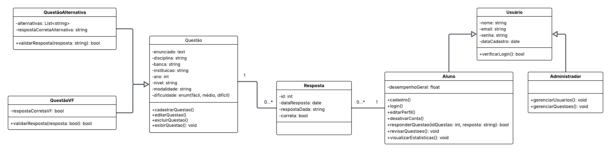

# Diagrama de Classe UML

O diagrama de classe UML abaixo representa a estrutura principal do sistema **ConcursoFácil**, destacando as entidades centrais, seus atributos, operações e os relacionamentos entre elas.

## Objetivos do Diagrama
- Modelar a estrutura estática do sistema.  
- Representar as principais classes do domínio.  
- Evidenciar herança, associações e multiplicidades.  
- Apoiar o desenvolvimento e servir como documentação técnica.  

## Descrição Geral
- **Usuário**: classe genérica que centraliza atributos comuns (nome, e-mail, senha, data de cadastro).  
- **Aluno**: especialização de Usuário, focado nas ações de responder questões, revisar e visualizar estatísticas.  
- **Administrador**: especialização de Usuário, responsável por gerenciar usuários e questões.  
- **Questão**: representa as perguntas, com atributos como enunciado, disciplina, banca, ano, nível, modalidade e dificuldade.  
  - **QuestãoAlternativa**: especialização com alternativas de múltipla escolha.  
  - **QuestãoVF**: especialização para questões de verdadeiro ou falso.  
- **Resposta**: histórico de respostas dos alunos, associando cada questão a um aluno e registrando data, resposta dada e se estava correta.

## Diagrama

## Observações
- O relacionamento entre **Aluno** e **Questão** é realizado através da classe **Resposta**, representando o histórico.  
- Multiplicidades:
  - Um **Aluno** pode ter várias respostas, mas cada **Resposta** pertence a apenas um aluno.  
  - Uma **Questão** pode ter várias respostas de diferentes alunos, mas cada **Resposta** está ligada a apenas uma questão.  
- O diagrama serve como base inicial e pode ser refinado conforme o sistema evolui.
