# Diagrama de Classe UML: Sistema ConcursoFácil

O diagrama de classe UML abaixo representa a **estrutura estática** atual do sistema **ConcursoFácil**. Ele destaca as principais entidades, seus atributos e os relacionamentos (associações) entre elas, conforme o modelo de dados atualizado.

---

## Objetivos do Diagrama

* Modelar a estrutura estática do sistema.
* Representar as classes centrais do domínio.
* Evidenciar associações e multiplicidades entre entidades.
* Apoiar o desenvolvimento e servir como documentação técnica.

---

## Descrição Geral das Entidades

| Classe | Descrição Principal |
| :--- | :--- |
| **Usuário** | Representa os usuários do sistema (dados pessoais, perfil, atividade). |
| **Perfil** | Categoria do usuário, determinando seu tipo no sistema. |
| **TokenVerificacao** | Códigos temporários para validação de conta ou recuperação de senha. |
| **Disciplina** | Área de conhecimento para classificação das questões. |
| **Questão** | O núcleo do sistema: enunciado, disciplina, banca, ano, dificuldade, nível e metadados. |
| **QuestãoAlternativa** | Contém as alternativas (A–E) de questões de múltipla escolha. |
| **Caderno** | Agrupador personalizado criado pelo usuário para organizar questões. |
| **CadernoQuestao** | Entidade de associação para o vínculo M:M entre `Caderno` e `Questão`. |
| **Simulado** | Conjunto de questões montado pelo sistema ou pelo usuário. |
| **SimuladoQuestao** | Define a lista de questões de um `Simulado` e sua ordem. |
| **SimuladoDisciplina** | Define quantas questões de cada `Disciplina` compõem o `Simulado`. |
| **ResoluçãoQuestão** | Histórico de respostas realizadas fora de simulados. |
| **ResoluçãoQuestãoSimulado** | Histórico de respostas dentro de simulados, incluindo estados "congelados" da questão. |
| **ResoluçãoQuestãoSimuladoAlternativa** | Armazena as alternativas da questão no momento exato da execução do simulado. |

---

## Diagrama

```mermaid
classDiagram

    %% ============================
    %% CONTROLLERS (AUTH)
    %% ============================

    class AuthController {
        +register(Request)
        +forgotPassword(Request)
        +verifyCode(Request)
        +resetPassword(Request)
        +login(Request)
        +logout(Request)
    }

    %% ============================
    %% CONTROLLERS (BACKEND)
    %% ============================

    class UsuarioController {
        +index()
        +show(id)
        +update(Request, id)
        +destroy(id)
    }

    class ResolucaoQuestaoController {
        +store(Request)
        +show(id)
        +historicoDetalhado(Request)
    }

    class QuestaoController {
        +filtros()
        +praticar(Request)
        +index(Request)
        +store(Request)
        +show(id)
        +update(Request, id)
        +destroy(id)
    }

    class DisciplinaController {
        +index(Request)
        +store(Request)
        +update(Request, id)
        +show(id)
        +destroy(id)
    }

    class DashboardController {
        +geral(Request)
        +historicoResolucoes(Request)
    }

    %% ============================
    %% MODELS - AUTENTICAÇÃO / USUÁRIOS
    %% ============================

    class Usuario {
        +id_usuario: int
        +id_perfil: int
        +primeiro_nome: string
        +ultimo_nome: string
        +username: string
        +email: string
        +senha_hash: string
        +foto_url: string
        +cargo: string
        +educacao: string
        +habilidades: string
        +notas: string
        +ativo: bool
        +ultimo_login: datetime
        +getAuthPassword()
        +resolucoes(): hasMany
        +createToken()
    }

    class TokenVerificacao {
        +id_token: int
        +id_usuario: int
        +tipo: string
        +codigo: string
        +expira_em: datetime
        +usado: bool
        +gerarCodigo() static
        +aindaValido(): bool
    }

    %% ============================
    %% MODELS - QUESTÕES
    %% ============================

    class Disciplina {
        +id_disciplina: int
        +nome: string
        +questoes(): hasMany
    }

    class Questao {
        +id_questao: int
        +codigo_questao: string
        +enunciado: string
        +tipo_questao: string
        +resposta_correta: string
        +gabarito_comentado: string
        +id_disciplina: int
        +assunto: string
        +banca: string
        +instituicao: string
        +ano: int
        +prova: string
        +dificuldade: string
        +nivel: string
        +cargo: string
        +area_formacao: string
        +area_atuacao: string
        +criado_por: int
        +atualizado_por: int
        +alternativas(): hasMany
    }

    class QuestaoAlternativa {
        +id_alternativa: int
        +id_questao: int
        +alternativa_a: string
        +alternativa_b: string
        +alternativa_c: string
        +alternativa_d: string
        +alternativa_e: string
        +questao(): belongsTo
    }

    %% ============================
    %% MODELS - RESOLUÇÕES
    %% ============================

    class ResolucaoQuestao {
        +id_resolucao: int
        +id_usuario: int
        +id_questao_original: int
        +codigo_questao: string
        +enunciado: string
        +tipo_questao: string
        +resposta_correta: string
        +gabarito_comentado: string
        +disciplina: string
        +assunto: string
        +banca: string
        +instituicao: string
        +ano: int
        +prova: string
        +dificuldade: string
        +nivel: string
        +cargo: string
        +area_formacao: string
        +area_atuacao: string
        +alternativa_marcada: string
        +acertou: bool
        +usuario(): belongsTo
        +questaoOriginal(): belongsTo
        +alternativas(): hasOne
    }

    class ResolucaoQuestaoAlternativa {
        +id_alternativa: int
        +id_resolucao: int
        +alternativa_a: string
        +alternativa_b: string
        +alternativa_c: string
        +alternativa_d: string
        +alternativa_e: string
        +resolucao(): belongsTo
    }

    %% ============================
    %% MODELS - CADERNOS (NOVO)
    %% ============================

    class Caderno {
        +id_caderno: int
        +id_usuario: int
        +nome: string
        +ativo: bool
        +data_criacao: datetime
        +data_atualizacao: datetime
        +usuario(): belongsTo
        +questoes(): manyToMany
    }

    class CadernoQuestao {
        +id_caderno: int
        +id_questao: int
        +data_vinculo: datetime
    }

    %% ============================
    %% MODELS - SIMULADOS (NOVO)
    %% ============================

    class Simulado {
        +id_simulado: int
        +id_usuario: int
        +nome: string
        +descricao: string
        +data_criacao: datetime
        +data_atualizacao: datetime
        +usuario(): belongsTo
    }

    class SimuladoQuestao {
        +id_simulado_questao: int
        +id_simulado: int
        +id_questao: int
        +ordem: int
    }

    class SimuladoDisciplina {
        +id_simulado_disciplina: int
        +id_simulado: int
        +id_disciplina: int
        +quantidade_questoes: int
    }

    %% ============================
    %% RELACIONAMENTOS ENTRE MODELS
    %% ============================

    TokenVerificacao --> Usuario : belongsTo
    Usuario --> ResolucaoQuestao : hasMany
    ResolucaoQuestao --> ResolucaoQuestaoAlternativa : hasOne
    ResolucaoQuestao --> Questao : questaoOriginal >
    Disciplina --> Questao : hasMany
    Questao --> QuestaoAlternativa : hasMany

    %% --- CADERNOS (NOVOS)
    Usuario --> Caderno : hasMany
    Caderno --> CadernoQuestao : hasMany
    CadernoQuestao --> Questao : belongsTo

    %% --- SIMULADOS (NOVOS)
    Usuario --> Simulado : hasMany
    Simulado --> SimuladoQuestao : hasMany
    Simulado --> SimuladoDisciplina : hasMany
    SimuladoQuestao --> Questao : belongsTo
    SimuladoDisciplina --> Disciplina : belongsTo

    %% ============================
    %% Controllers usam Models
    %% ============================

    AuthController --> Usuario : usa >
    AuthController --> TokenVerificacao : usa >

    UsuarioController --> Usuario : usa >
    QuestaoController --> Questao : usa >
    QuestaoController --> QuestaoAlternativa : usa >
    QuestaoController --> Disciplina : usa >

    ResolucaoQuestaoController --> ResolucaoQuestao : usa >
    ResolucaoQuestaoController --> Questao : usa >
    ResolucaoQuestaoController --> ResolucaoQuestaoAlternativa : usa >

    DisciplinaController --> Disciplina : usa >
    DashboardController --> ResolucaoQuestao : usa >



```

## Observações e Multiplicidades

O relacionamento entre **`Usuário`** e **`Questão`** no histórico de respostas é representado pelas entidades **`ResoluçãoQuestão`** e **`ResoluçãoQuestãoSimulado`**.

### Multiplicidades Principais

* Um **`Usuário`** pode possuir vários **`Cadernos`** (1:N).
* Um **`Caderno`** pode conter várias **`Questões`** (via `CadernoQuestao`).
* Uma **`Disciplina`** possui várias **`Questões`** (1:N).
* Um **`Simulado`** contém várias **`Questões`** e várias **`Disciplinas`** definidas em sua composição (N:M).
* Cada **`Questão`** possui **exatamente um** conjunto de **`QuestãoAlternativa`** (1:1).

> **Nota:** Este diagrama serve como documentação base e deve ser refinado conforme novas funcionalidades forem adicionadas ao sistema.